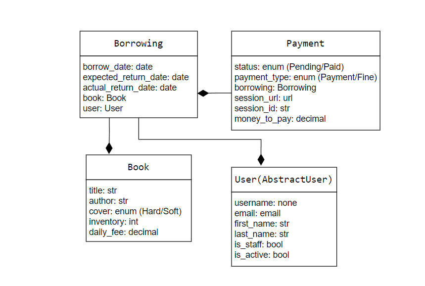

# Library Service:

Overview
A Django-based web application for managing book borrowings and inventory in a local library. 
Features include book CRUD operations, user authentication, borrowing tracking, Stripe payments integration, Telegram notifications, and comprehensive API documentation.

## Instalation
```
git clone `https://github.com/haldaniko/Library-service.git`
cd library-service
```
- Copy .env.sample to .env and populate it with all required data.
```
docker-compose build
docker-compose up
```
- Create new admin user. `docker-compose exec app python manage.py createsuperuser`;

The API will be available at `http://127.0.0.1:8000/`

## Architecture


## Structure


