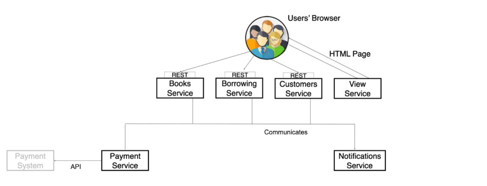

# Library Service:

Overview
A Django-based web application for managing book borrowings and inventory in a local library. 
Features include book CRUD operations, user authentication, borrowing tracking, Stripe payments integration, Telegram notifications, and comprehensive API documentation.

## Installation
#### Docker 
```
git clone https://github.com/haldaniko/coffee-shop-catalogue.git
cd coffee-shop-catalogue

(Copy .env.sample to .env and populate it with all required data)

docker-compose build
docker-compose up

(Create new admin user)
docker-compose exec app python manage.py createsuperuser;
```


#### Manual
```
git clone `https://github.com/haldaniko/Library-DjangoAPI.git`
cd Library-DjangoAPI

# on macOS
python3 -m venv venv
source venv/bin/activate

# on Windows
python -m venv venv
venv\Scripts\activate

pip install -r requirements.txt

(Copy .env.sample to .env and populate it with all required data.)

python manage.py migrate
python manage.py loaddata newspapers_db_data.json
python manage.py runserver

(Create new admin user)
python manage.py createsuperuser
```

The API will be available at `http://127.0.0.1:8000/`

## Architecture



## Structure


